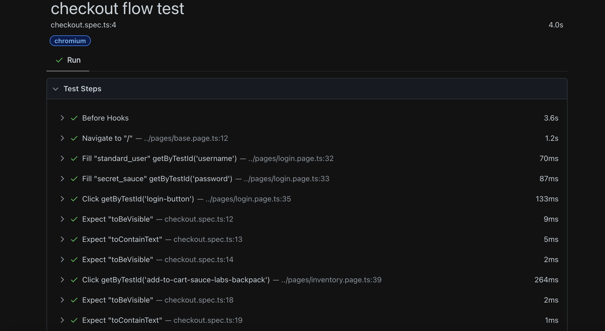
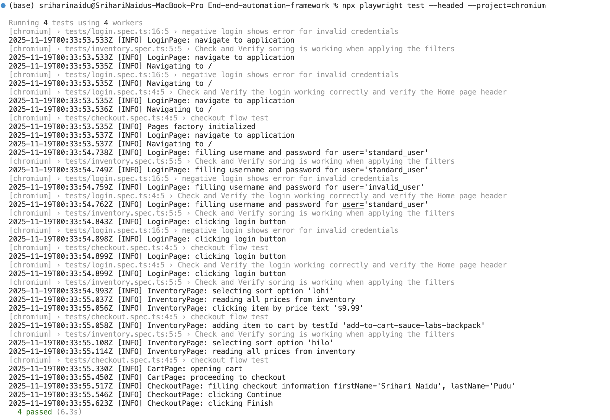

# End-to-end automation framework (Playwright + TypeScript)

A scalable and modular UI automation framework built using Playwright + TypeScript, targeting the Saucedemo sample application.
The framework follows POM (Page Object Model) principles and uses stable selectors `(data-test)`, with lightweight logging and clean test structuring.

---

## Table of contents

- Overview
- Project layout
- Installation
- Running tests
- Reports and logs
- Test cases (what's covered)
- How to add tests
- Troubleshooting
- Next steps / improvements

---

## Overview

This project shows a practical approach to E2E testing with Playwright and TypeScript. The main ideas:

- Page objects live in `pages/` and contain locators and reusable actions.
- Tests live in `tests/` and contain assertions. Page objects do not assert.
- Selectors use `data-test` attributes; Playwright is configured to treat `data-test` as the test id attribute.
- Logs are added from page objects to give step-level visibility during runs.

## Project layout

```
pages/
  base.page.ts          # Common Playwright helpers
  login.page.ts         # Login page actions & selectors
  inventory.page.ts     # Inventory page actions 
  cart.page.ts          # Cart page interactions
  checkout.page.ts      # Multi-step checkout process
  pageFactory.ts        # Central factory for all page objects
  logger.ts             # Small timestamp-based logger

tests/
  login.spec.ts         # Positive & negative login tests
  inventory.spec.ts     # Sorting tests (Low→High, High→Low)
  checkout.spec.ts      # Add to cart + checkout completion

utils/                  # (If you add helpers later)
playwright.config.ts    # Playwright test runner configuration
package.json            # Dev dependencies & metadata
README.md
```


## Installation

1. Install dependencies:

```bash
npm install
npx playwright install
```

2. (Optional) If you use yarn:

```bash
yarn
yarn playwright install
```

## Running tests

- Run all tests:

```bash
npx playwright test
```

- Run a single spec (example):

```bash
npx playwright test tests/inventory.spec.ts --project=chromium
```

- Run tests headed (open browser windows):

```bash
npx playwright test --headed
```

## Reports and logs

- The HTML test report can be opened with:

```bash
npx playwright show-report
```

- Logs: Page objects use `pages/logger.ts` to print timestamped messages to stdout. These show in the terminal and are also captured by the Playwright report when attached.

Example log lines:

```
2025-11-18T12:00:00.000Z [INFO] LoginPage: navigate to /
2025-11-18T12:00:01.000Z [INFO] InventoryPage: selecting sort option 'lohi'
```

### Screenshots & demo video

The repository includes a small set of screenshots and a demo video captured during runs. You can open these files directly from the repository (click the links) or view the images inline below.

- Demo video: [End-to-end demo video](./screenshots/EndToEndDemoVideo.mov)
- HTML report (screenshot): [HTML REPORT.png](./screenshots/HTML%20REPORT.png)
- Single test case run (screenshot): [OneTestCase.png](./screenshots/OneTestCase.png)
- Terminal test report (screenshot): [TerminalTestReport.png](./screenshots/TerminalTestReport.png)

Inline previews (click to open full file):






> Note: The video file may not preview in the web UI but clicking the link will download/open it locally.

## Test cases (what's covered)

The repository contains tests that exercise the main flows. The exact implemented scenarios:

### Test Scenario 1 — Sorting (inventory.spec.ts)

Steps:
1. Log in to the application using a standard user account (`standard_user` / `secret_sauce`).
2. Apply the Price filter in the following sequence:
   - Low to High (`lohi`)
   - High to Low (`hilo`)
3. Verify that the items are sorted correctly according to the selected filter. The test reads numeric prices from the DOM (using InventoryPage.getAllPrices()) and asserts the array is ordered ascending or descending.

### Test Scenario 2 — Checkout flow (checkout.spec.ts)

Steps:
1. Log in to the application using a standard user account.
2. Select an item and add it to the cart.
3. Proceed to checkout and fill the information form.
4. Continue to the overview and finish the order.
5. Verify the checkout complete screen and the 'Thank you for your order!' message.

### Login tests
- Positive login test: verify landing page headers after a successful login.
- Negative login test: attempt login with invalid credentials and validate the error message exactly

## How selectors are handled

- The project standard is to add `data-test` attributes in the application markup and reference them via `page.getByTestId('name')` in page objects. This keeps selectors decoupled from visual structure and text.
- Playwright is configured with `testIdAttribute: 'data-test'` in `playwright.config.ts`.

## How to add tests

1. Add or extend a page object in `pages/` for any new interactions.
2. Create a spec in `tests/` that imports the page object and performs actions.
3. Keep assertions in the spec itself.
4. Prefer using `getByTestId` for locators and small helper methods that return values useful for assertions (for example `getAllPrices`).

## Test data and credentials

- Demo credentials used in tests (Saucedemo):
  - Username: `standard_user`
  - Password: `secret_sauce`